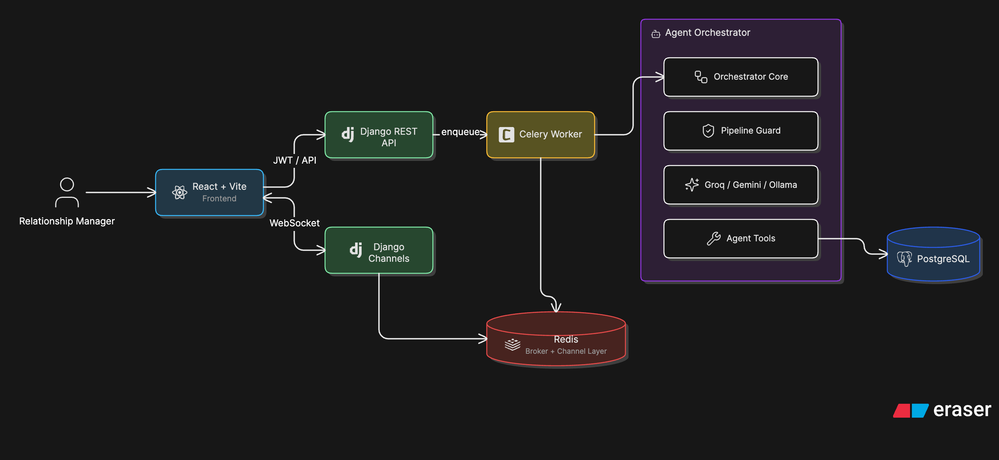

# BankIQ CRM

BankIQ CRM is an agentic AI CRM for banking Relationship Managers (RMs). RMs describe a campaign in plain language; BankIQ searches their assigned portfolio, reviews customer history, scores conversion likelihood, enforces compliance checks, and prepares masked outreach drafts.

The current codebase is a full-stack local development app with Django REST, Django Channels, Celery, Redis, PostgreSQL, and a React/Vite frontend.

## Stack

| Layer | Technology |
| --- | --- |
| Backend API | Django 5, Django REST Framework, Simple JWT |
| Async work | Celery with Redis broker/result backend |
| Realtime updates | Django Channels over WebSocket |
| Database | PostgreSQL |
| Frontend | React 18, Vite, TypeScript, Tailwind CSS |
| State/data | Zustand, TanStack Query, Axios |
| LLM providers | Groq primary, Gemini fallback, Ollama local/offline |
| API docs | drf-spectacular OpenAPI and Swagger UI |

## Prerequisites

| Tool | Version |
| --- | --- |
| Python | 3.11+ |
| Node.js | 20+ |
| PostgreSQL | 14+; 15 recommended |
| Redis | 7+ |
| Docker Compose | Optional, for containerized services |

Agent features need at least one configured LLM provider:

```env
GROQ_API_KEY=your_groq_key
GEMINI_API_KEY=your_gemini_key
OLLAMA_BASE_URL=http://localhost:11434
```

## System Architecture



## Project Structure

```text
finance-crm-agent/
├── .cursorrules
├── README.md
└── bankiq/
    ├── .env.example
    ├── docker-compose.yml
    ├── backend/
    │   ├── config/
    │   │   ├── settings/
    │   │   │   ├── base.py
    │   │   │   ├── dev.py
    │   │   │   └── prod.py
    │   │   ├── asgi.py
    │   │   ├── celery.py
    │   │   ├── middleware.py
    │   │   └── urls.py
    │   ├── apps/
    │   │   ├── accounts/
    │   │   ├── agent/
    │   │   ├── campaigns/
    │   │   └── customers/
    │   ├── agent_core/
    │   │   ├── orchestrator.py
    │   │   ├── pipeline_guard.py
    │   │   ├── input_sanitizer.py
    │   │   ├── llm_selector.py
    │   │   └── tools/
    │   ├── tasks/
    │   ├── tests/
    │   ├── manage.py
    │   ├── requirements.txt
    │   ├── run-celery.sh
    │   └── run-server.sh
    └── frontend/
        ├── .env.example
        ├── package.json
        └── src/
            ├── components/
            ├── hooks/
            ├── pages/
            ├── store/
            ├── types/
            └── lib/
```

## Local Development

### One-command setup and run

From the repo root:

```bash
./setup-and-run.sh
```

This creates `bankiq/.env` when needed, links `backend/.env`, starts Postgres and Redis with Docker Compose, installs backend/frontend dependencies, runs migrations, seeds demo data, and starts the backend, Celery worker, and frontend.

Useful variants:

```bash
./setup-and-run.sh --setup-only
./setup-and-run.sh --run-only
./setup-and-run.sh --no-install
./setup-and-run.sh --no-infra
```

The frontend runs at [http://localhost:5173](http://localhost:5173), and the API docs run at [http://localhost:8000/api/v1/docs/](http://localhost:8000/api/v1/docs/).

### 1. Configure environment

```bash
cd bankiq
cp .env.example .env
ln -sf ../.env backend/.env
```

`manage.py`, ASGI, and Celery default to `config.settings.dev`. The backend reads environment values through `python-decouple`.

For local Postgres and Redis, the default `.env.example` values are:

```env
POSTGRES_DB=bankiq
POSTGRES_USER=bankiq
POSTGRES_PASSWORD=bankiq
POSTGRES_HOST=localhost
POSTGRES_PORT=5432
REDIS_URL=redis://127.0.0.1:6379/0
CELERY_BROKER_URL=redis://127.0.0.1:6379/1
CELERY_RESULT_BACKEND=redis://127.0.0.1:6379/2
CORS_ALLOWED_ORIGINS=http://localhost:5173,http://localhost:5174
```

### 2. Start PostgreSQL and Redis

With Homebrew on macOS:

```bash
brew services start postgresql@15
brew services start redis
```

Create the development database once:

```bash
psql postgres -c "CREATE USER bankiq WITH PASSWORD 'bankiq' CREATEDB;"
psql postgres -c "CREATE DATABASE bankiq OWNER bankiq;"
```

Or start only the infrastructure with Docker:

```bash
cd bankiq
docker compose up -d postgres redis
```

### 3. Set up the backend

```bash
cd bankiq/backend
python3 -m venv .venv
source .venv/bin/activate
pip install -r requirements.txt
python manage.py migrate
python manage.py seed_demo
```

`seed_demo` creates the demo RM user and 100 sample customers.

| Field | Value |
| --- | --- |
| Username | `rm_demo` |
| Password | `demo1234` |

Run the API and WebSocket server:

```bash
cd bankiq/backend
./run-server.sh
```

Run the Celery worker in a second terminal:

```bash
cd bankiq/backend
./run-celery.sh
```

Use these wrapper scripts so the project virtualenv is used instead of a global or Conda executable.

### 4. Set up the frontend

```bash
cd bankiq/frontend
npm install
npm run dev
```

Vite usually starts at [http://localhost:5173](http://localhost:5173). If that port is busy, use the URL Vite prints.

Optional frontend overrides:

```bash
cd bankiq/frontend
cp .env.example .env.local
```

```env
VITE_API_BASE_URL=http://localhost:8000/api/v1
VITE_WS_BASE_URL=ws://localhost:8000
```

## Docker Compose

For the full stack:

```bash
cd bankiq
cp .env.example .env
```

If using Docker for backend services, set Docker hostnames in `.env`:

```env
POSTGRES_HOST=postgres
REDIS_URL=redis://redis:6379/0
CELERY_BROKER_URL=redis://redis:6379/1
CELERY_RESULT_BACKEND=redis://redis:6379/2
OLLAMA_BASE_URL=http://host.docker.internal:11434
```

Then start:

```bash
docker compose up --build
```

Services:

| Service | Port |
| --- | --- |
| Backend Daphne server | `8000` |
| Frontend Vite dev server | `5173` |
| PostgreSQL | internal Docker network |
| Redis | internal Docker network |
| Celery worker | internal |
| Celery beat | internal |

Run migrations and seed data inside Docker:

```bash
docker compose exec backend python manage.py migrate
docker compose exec backend python manage.py seed_demo
```

## Application URLs

| Service | URL |
| --- | --- |
| Frontend | [http://localhost:5173](http://localhost:5173) |
| API root | [http://localhost:8000/api/v1/](http://localhost:8000/api/v1/) |
| OpenAPI schema | [http://localhost:8000/api/v1/schema/](http://localhost:8000/api/v1/schema/) |
| Swagger UI | [http://localhost:8000/api/v1/docs/](http://localhost:8000/api/v1/docs/) |
| JWT login | `POST /api/v1/auth/token/` |
| JWT refresh | `POST /api/v1/auth/token/refresh/` |
| Agent WebSocket | `ws://localhost:8000/ws/agent/<session_id>/?token=<access>` |

All API endpoints except token login/refresh require:

```http
Authorization: Bearer <access_token>
```

Access tokens last 15 minutes. Refresh tokens last 7 days.

## API Overview

Registered router endpoints include:

```text
GET/POST      /api/v1/accounts/rms/
GET/POST      /api/v1/customers/
GET/POST      /api/v1/transactions/
GET/POST      /api/v1/campaigns/
GET/POST      /api/v1/outreach/
POST          /api/v1/agent/query/
```

`POST /api/v1/agent/query/` accepts:

```json
{
  "session_id": "generated-client-uuid",
  "query": "Find high-value customers likely to convert for a personal loan this month"
}
```

It returns HTTP `202 Accepted` and streams progress over the WebSocket group `agent_<session_id>`.

## Agent Pipeline

The agent pipeline is enforced by `agent_core.pipeline_guard.PipelineGuard`.

```text
INIT
SEARCH
FETCH_HISTORY
SCORE
COMPLIANCE
GENERATE_MESSAGES
FINALIZE
DONE
```

Compliance is mandatory. `finalize_results` is rejected until the compliance stage has been visited. Tool execution is routed through `execute_tool(name, inputs)`, and guarded violations return a structured `PIPELINE_GUARD_ERROR`.

Current registered tools:

| Tool | Stage | Input | Output | Why it exists |
| --- | --- | --- | --- | --- |
| `search_customers` | `SEARCH` | RM id, income, credit score, EMI filters | Masked candidate customers | Converts natural-language targeting into structured portfolio search |
| `get_transaction_history` | `FETCH_HISTORY` | Customer ids | Monthly debit, credit, and balance summaries | Adds behavior context beyond static profile data |
| `calculate_conversion_score` | `SCORE` | Customer ids | Score per customer | Ranks leads using transparent heuristics |
| `check_regulatory_compliance` | `COMPLIANCE` | Customer ids | Approved and rejected customers with reasons | Prevents unsafe outreach before message generation |
| `generate_messages` | `GENERATE_MESSAGES` | Approved ids and scores | Product recommendations and WhatsApp drafts | Produces personalized outreach from customer attributes |
| `finalize_results` | `FINALIZE` | Approved ids and messages | Summary counts and campaign records | Persists campaign output when a campaign id is provided |

Compliance checks currently include DNC registry, active dispute, KYC completion, minimum age, and consent flag.

## Execution Flow

1. The RM logs in and receives JWT access and refresh tokens.
2. The frontend creates a `session_id`, opens a WebSocket, and posts the RM query to `/api/v1/agent/query/`.
3. Django authenticates the RM, validates the query, rate-limits the request, and enqueues a Celery task.
4. Celery runs the agent orchestrator outside the HTTP request cycle.
5. The orchestrator sanitizes input, chooses an LLM provider, and executes only registered tools.
6. `PipelineGuard` enforces strict stage order, including mandatory compliance before messages or final output.
7. Tools read structured data from PostgreSQL, mask PII, score leads, reject non-compliant leads, and generate personalized outreach.
8. Celery publishes stage updates through Django Channels and Redis.
9. The frontend displays live progress and the final campaign summary.

## Key Design Decisions

| Decision | Reason |
| --- | --- |
| Celery for orchestration execution | Avoids HTTP timeouts and keeps the UI responsive |
| Redis for broker and realtime channel layer | One lightweight service supports background jobs and WebSocket fanout |
| PostgreSQL as source of truth | CRM data is relational and benefits from indexed structured queries |
| Deterministic fallback path | Demo still works if an LLM provider fails or returns no tool calls |
| PII masking in tools | Sensitive banking fields are protected before results reach the agent response |

## Trade-offs and Limitations

| Choice | Benefit | Trade-off |
| --- | --- | --- |
| Strict ordered pipeline | Safer and easier to audit | Less flexible than a fully autonomous agent |
| Rule-based score | Transparent for evaluators | Less accurate than a trained ML model |
| Rule-based compliance | Deterministic and explainable | Needs maintenance as policy changes |
| Celery + Redis | Reliable async execution | More infrastructure than a single-process app |
| WebSockets | Real-time UX | More operational complexity than polling |
| Aggressive PII masking | Safer banking default | Some details are hidden from the UI |
| Multiple LLM providers | Better resilience | Provider outputs may differ |

## Data and Compliance Model

Key CRM entities use UUID primary keys. Customer PII fields include name, phone, email, PAN, Aadhaar, and account number. API serializers and agent tools are expected to return masked PII only.

Important customer compliance fields:

```text
kyc_status
marketing_consent
do_not_contact
has_active_dispute
```

Important indexed customer filters:

```text
annual_income
credit_score
emi_ratio
kyc_status
do_not_contact
marketing_consent
last_login
tenure_years
```

Financial values are stored with `DecimalField`, not floats.

## Frontend Notes

The frontend has two routes:

| Route | Description |
| --- | --- |
| `/login` | JWT login screen |
| `/` | Protected campaign assistant workspace |

Important modules:

| Path | Purpose |
| --- | --- |
| `src/hooks/useAuth.ts` | Login, refresh, logout, in-memory tokens |
| `src/hooks/useAgent.ts` | REST query dispatch and WebSocket lifecycle |
| `src/hooks/useCampaigns.ts` | Campaign API access through React Query |
| `src/store/authStore.ts` | Auth state |
| `src/store/pipelineStore.ts` | Stage history and agent messages |
| `src/store/campaignStore.ts` | Campaign state |
| `src/store/uiStore.ts` | UI loading/error/modal state |
| `src/types/api.ts` | API response types |
| `src/types/agent.ts` | Pipeline and agent event types |

## Running Tests

Backend:

```bash
cd bankiq/backend
source .venv/bin/activate
pytest tests/ -q
```

Frontend:

```bash
cd bankiq/frontend
npm run build
npm test
```

Useful frontend checks:

```bash
cd bankiq/frontend
npm run lint
npm run preview
```

## Common Issues

| Problem | Fix |
| --- | --- |
| Postgres connection refused | Start PostgreSQL and confirm `POSTGRES_HOST=localhost` for local dev |
| Redis connection refused | Start Redis and confirm `REDIS_URL=redis://127.0.0.1:6379/0` |
| Login fails | Run `python manage.py seed_demo` |
| Agent query stays queued | Start Celery with `./run-celery.sh` |
| WebSocket closes immediately | Make sure the frontend sends `?token=<access>` and Redis is running |
| `No module named decouple` in Celery | Use `./run-celery.sh` from `bankiq/backend` |
| LLM provider errors | Set `GROQ_API_KEY`, `GEMINI_API_KEY`, or run Ollama locally |
| Docker backend cannot reach Postgres | Set `POSTGRES_HOST=postgres` in `bankiq/.env` |

## Demo Queries

```text
Find high-value customers likely to convert for a personal loan this month and generate personalized WhatsApp messages.
```

```text
Find customers with income above 15 lakh, CIBIL score above 760, and EMI below 25 percent for a premium personal loan offer.
```

```text
Find eligible personal loan leads but exclude anyone without consent, incomplete KYC, active disputes, or Do Not Contact status.
```

Video walkthrough script: [docs/demo-video-script.md](./docs/demo-video-script.md)
